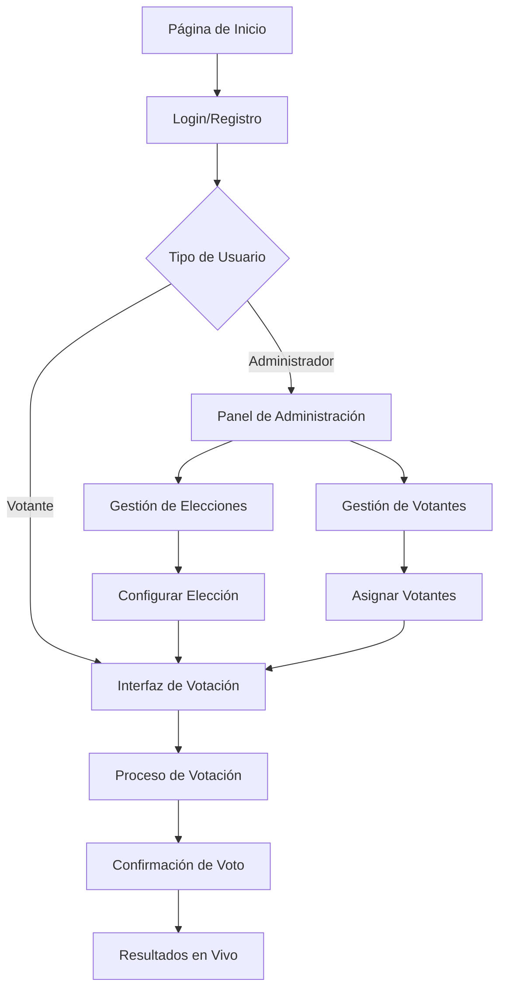

## 1. Product Overview

Plataforma de votación digital segura para organizaciones, instituciones y empresas que necesitan gestionar procesos electorales de manera confiable y transparente. La plataforma permite crear elecciones personalizadas, gestionar votantes, y garantizar la integridad del proceso electoral con auditoría completa.

Dirigido a organizaciones que requieren elecciones democráticas con altos estándares de seguridad, transparencia y trazabilidad. Ideal para corporaciones, universidades, sindicatos, y gobiernos locales que necesitan una solución profesional de votación electrónica.

## 2. Core Features

### 2.1 User Roles

| Role | Registration Method | Core Permissions |
|------|---------------------|------------------|
| Votante | Registro con RUT y verificación email | Votar en elecciones asignadas, ver resultados |
| Administrador | Designado por organización | Crear/editar elecciones, gestionar votantes, ver estadísticas completas |
| Super Admin | Sistema | Gestión multi-organización, acceso total al sistema |

### 2.2 Feature Module

Nuestra plataforma de votación consiste en las siguientes páginas principales:

1. **Página de Inicio**: Presentación de la plataforma, acceso a login/registro, información de seguridad.
2. **Login/Registro**: Autenticación con RUT, verificación de email, recuperación de contraseña.
3. **Panel de Administración**: CRUD de elecciones, gestión de votantes, configuración de votaciones.
4. **Interfaz de Votación**: Lista de elecciones disponibles, proceso de votación con confirmación en 2 pasos.
5. **Resultados en Vivo**: Visualización en tiempo real de resultados, gráficos interactivos, exportación de datos.
6. **Perfil de Usuario**: Información personal, historial de votaciones, configuración de seguridad (2FA).

### 2.3 Page Details

| Page Name | Module Name | Feature description |
|-----------|-------------|---------------------|
| Página de Inicio | Hero section | Presentación de la plataforma con estadísticas de uso, testimonios de seguridad, llamada a la acción para registrarse. |
| Página de Inicio | Navegación principal | Menú con acceso a login, información de la plataforma, contacto y ayuda. |
| Login/Registro | Formulario de autenticación | Login con RUT y contraseña, validación de formato RUT chileno, captcha para prevenir ataques. |
| Login/Registro | Registro de nuevo usuario | Formulario con RUT, nombre completo, email, contraseña, validación de RUT único y verificación de email. |
| Login/Registro | Recuperación de contraseña | Proceso de recuperación via email con token temporal y expiración. |
| Panel de Administración | Dashboard principal | Vista general con estadísticas de elecciones activas, votantes registrados, participación. |
| Panel de Administración | Gestión de Elecciones | CRUD completo: crear elección con título, descripción, opciones, imágenes, fecha inicio/fin, categorías. |
| Panel de Administración | Gestión de Votantes | Importación masiva de votantes, asignación a elecciones, estado de votación por usuario. |
| Panel de Administración | Configuración de Seguridad | Activar/desactivar 2FA, límites de intentos de login, configuración de auditoría. |
| Interfaz de Votación | Lista de Elecciones | Mostrar elecciones disponibles para el votante con información de tiempo restante. |
| Interfaz de Votación | Proceso de Votación | Selección de opción, revisión de selección, confirmación con contraseña o 2FA. |
| Interfaz de Votación | Confirmación de Voto | Mensaje de éxito, comprobante de votación con hash único para verificación. |
| Resultados en Vivo | Dashboard de Resultados | Gráficos en tiempo real con conteo de votos, porcentajes, participación. |
| Resultados en Vivo | Exportación de Datos | Generar reportes en PDF/Excel con resultados detallados y auditoría. |
| Perfil de Usuario | Información Personal | Editar datos básicos, cambio de contraseña, historial de actividad. |
| Perfil de Usuario | Seguridad | Activar 2FA con aplicación autenticadora, verificación de dispositivos. |

## 3. Core Process

### Flujo de Votante
El usuario accede a la plataforma, se registra con su RUT válido chileno y verifica su email. Una vez autenticado, puede ver las elecciones disponibles asignadas a su organización. Selecciona una elección, elige su opción preferida, revisa su selección y confirma con contraseña o 2FA. Recibe un comprobante único y puede ver resultados cuando la elección finalice.

### Flujo de Administrador
El administrador crea la elección configurando opciones, plazos, y asignando votantes. Monitorea la participación en tiempo real, gestiona incidencias, y cuando finaliza la elección accede a resultados completos con auditoría detallada. Puede exportar reportes y gestionar múltiples elecciones simultáneamente.

## 4. User Interface Design

### 4.1 Design Style

- **Colores Primarios**: Azul institucional (#1E3A8A) para transmitir confianza y seriedad
- **Colores Secundarios**: Blanco (#FFFFFF) y gris claro (#F3F4F6) para fondos, verde (#10B981) para éxito, rojo (#EF4444) para errores
- **Estilo de Botones**: Botones redondeados con sombra sutil, efecto hover con cambio de tono
- **Tipografía**: Inter para headers, Roboto para contenido, tamaños base 16px con jerarquía clara
- **Layout**: Diseño card-based con sombras suaves, navegación superior fija, contenido centrado con max-width
- **Iconos**: Estilo outline consistente, uso de emojis relevantes para estados (✅ ❌ ⚠️)

### 4.2 Page Design Overview

| Page Name | Module Name | UI Elements |
|-----------|-------------|-------------|
| Página de Inicio | Hero section | Imagen de fondo con overlay azul, título grande blanco, subtítulo, CTA principal en botón verde destacado |
| Login/Registro | Formulario | Tarjetas centradas con bordes redondeados, campos con iconos, botón primario azul, enlaces de ayuda en gris |
| Panel de Administración | Dashboard | Grid de estadísticas con iconos, gráficos circulares para participación, tabla de elecciones con estado colorido |
| Interfaz de Votación | Lista de Elecciones | Cards horizontales con imagen, título, descripción corta, contador de tiempo con emoji ⏰, botón de votar |
| Interfaz de Votación | Proceso de Votación | Opciones en cards grandes con radio buttons, imagen de opción, barra de progreso superior, botones de navegación |
| Resultados en Vivo | Dashboard | Gráfico de barras animado, tarjetas de métricas con números grandes, tabla de participación por grupo |
| Perfil de Usuario | Información Personal | Formulario en dos columnas, avatar circular, secciones con separadores, botón de guardar en parte inferior |

### 4.3 Responsiveness

Diseño mobile-first con breakpoints en 640px, 768px, y 1024px. Navegación colapsable en móvil con menú hamburguesa. Formularios adaptables a una columna en pantallas pequeñas. Gráficos y tablas con scroll horizontal en móvil. Botones de tamaño táctil mínimo 44px para facilitar interacción en dispositivos táctiles.