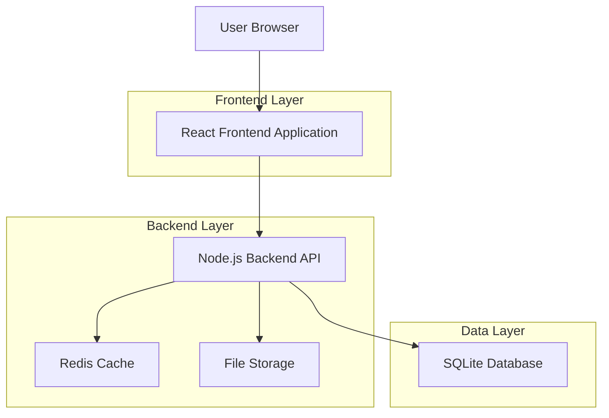
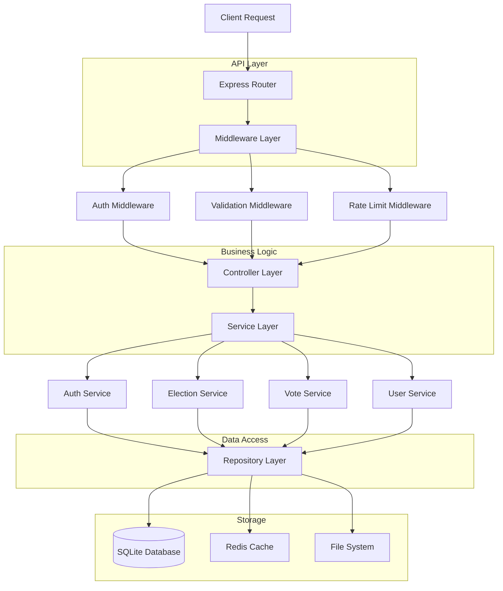
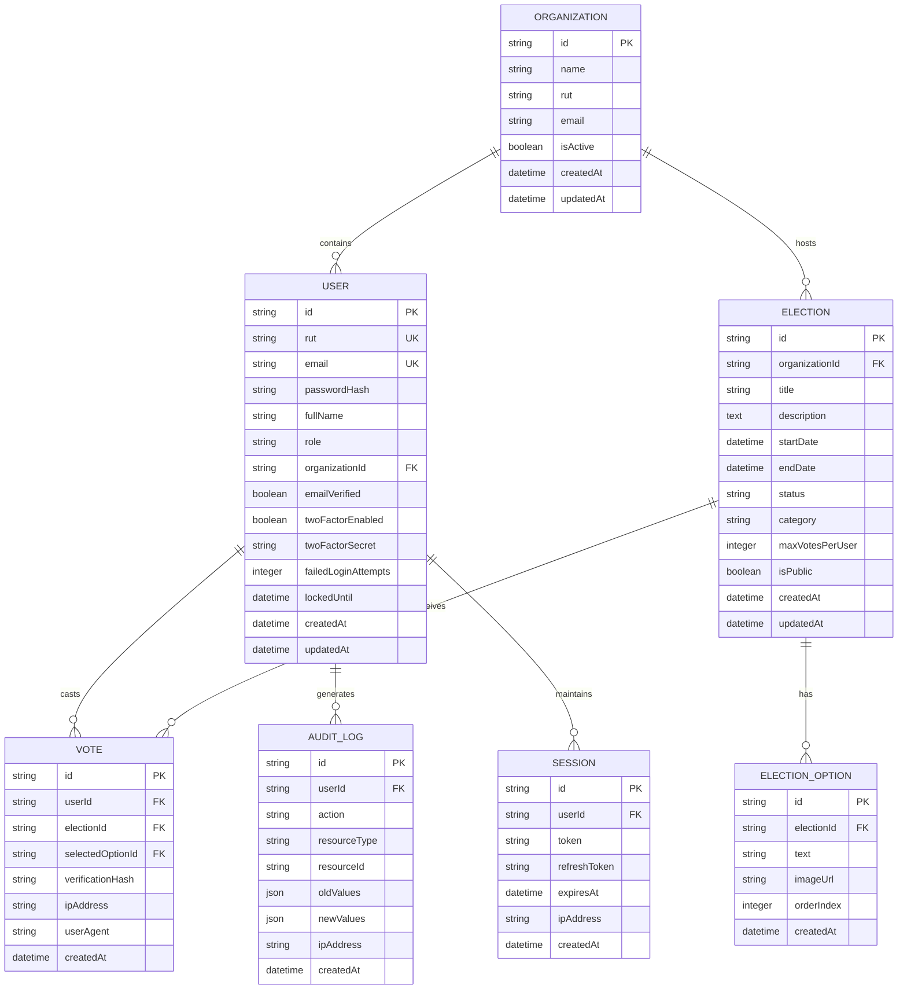

## 1. Architecture design



## 2. Technology Description

* **Frontend**: React\@18 + TypeScript\@5 + Vite\@4 + TailwindCSS\@3

* **Backend**: Node.js\@18 + Express\@4 + TypeScript\@5

* **Database**: SQLite\@5 con Sequelize ORM\@6

* **Cache**: Redis\@7 para sesiones y rate limiting

* **Autenticación**: JWT con refresh tokens

* **Validación**: RUT chileno con librería rut-chileno

* **Criptografía**: bcrypt para passwords, crypto para datos sensibles

## 3. Route definitions

| Route             | Purpose                                           |
| ----------------- | ------------------------------------------------- |
| /                 | Página de inicio con información de la plataforma |
| /login            | Página de autenticación de usuarios               |
| /register         | Registro de nuevos votantes                       |
| /dashboard        | Panel principal post-login                        |
| /admin/elections  | Gestión de elecciones (admin)                     |
| /admin/voters     | Gestión de votantes (admin)                       |
| /voting           | Lista de elecciones disponibles para votar        |
| /voting/:id       | Interfaz de votación para elección específica     |
| /results          | Visualización de resultados                       |
| /profile          | Perfil de usuario y configuración                 |
| /api/auth/\*      | Endpoints de autenticación                        |
| /api/elections/\* | CRUD de elecciones                                |
| /api/votes/\*     | Procesamiento de votos                            |
| /api/users/\*     | Gestión de usuarios                               |

## 4. API definitions

### 4.1 Authentication APIs

**Login de Usuario**

```
POST /api/auth/login
```

Request:

| Param Name     | Param Type | isRequired | Description                                |
| -------------- | ---------- | ---------- | ------------------------------------------ |
| rut            | string     | true       | RUT chileno con formato (ej: 12.345.678-9) |
| password       | string     | true       | Contraseña del usuario                     |
| recaptchaToken | string     | true       | Token de reCAPTCHA                         |

Response:

| Param Name   | Param Type | Description                   |
| ------------ | ---------- | ----------------------------- |
| success      | boolean    | Estado de la autenticación    |
| token        | string     | JWT token para sesión         |
| refreshToken | string     | Token para renovar sesión     |
| user         | object     | Datos del usuario autenticado |

Example:

```json
{
  "rut": "12.345.678-9",
  "password": "SecurePass123!",
  "recaptchaToken": "03AGdB..."
}
```

**Registro de Usuario**

```
POST /api/auth/register
```

Request:

| Param Name     | Param Type | isRequired | Description                                           |
| -------------- | ---------- | ---------- | ----------------------------------------------------- |
| rut            | string     | true       | RUT chileno válido                                    |
| email          | string     | true       | Email válido para verificación                        |
| password       | string     | true       | Mínimo 8 caracteres, mayúsculas, minúsculas y números |
| fullName       | string     | true       | Nombre completo del usuario                           |
| organizationId | string     | true       | ID de la organización                                 |

**Verificación de Email**

```
GET /api/auth/verify-email/:token
```

**Refrescar Token**

```
POST /api/auth/refresh
```

### 4.2 Election APIs

**Crear Elección** (Admin)

```
POST /api/elections
```

Request:

| Param Name      | Param Type | isRequired | Description                              |
| --------------- | ---------- | ---------- | ---------------------------------------- |
| title           | string     | true       | Título de la elección                    |
| description     | string     | true       | Descripción detallada                    |
| startDate       | datetime   | true       | Fecha y hora de inicio                   |
| endDate         | datetime   | true       | Fecha y hora de término                  |
| options         | array      | true       | Array de opciones con {text, image?}     |
| category        | string     | true       | Categoría de la elección                 |
| maxVotesPerUser | integer    | false      | Máximo de votos por usuario (default: 1) |

**Listar Elecciones**

```
GET /api/elections
```

Query Parameters:

| Param Name | Param Type | Description                                      |
| ---------- | ---------- | ------------------------------------------------ |
| status     | string     | Filtrar por estado: active, completed, scheduled |
| category   | string     | Filtrar por categoría                            |
| page       | integer    | Número de página para paginación                 |
| limit      | integer    | Cantidad de resultados por página                |

**Obtener Detalle de Elección**

```
GET /api/elections/:id
```

### 4.3 Voting APIs

**Emitir Voto**

```
POST /api/votes
```

Request:

| Param Name           | Param Type | isRequired | Description                    |
| -------------------- | ---------- | ---------- | ------------------------------ |
| electionId           | string     | true       | ID de la elección              |
| selectedOption       | string     | true       | ID de la opción seleccionada   |
| confirmationPassword | string     | true       | Contraseña para confirmar voto |
| twoFactorCode        | string     | false      | Código 2FA si está habilitado  |

Response:

| Param Name       | Param Type | Description                      |
| ---------------- | ---------- | -------------------------------- |
| success          | boolean    | Estado del voto                  |
| voteId           | string     | ID único del voto                |
| verificationHash | string     | Hash para verificación posterior |
| timestamp        | datetime   | Fecha y hora del voto            |

**Obtener Resultados**

```
GET /api/votes/results/:electionId
```

**Verificar Voto**

```
GET /api/votes/verify/:voteId/:hash
```

### 4.4 User Management APIs

**Listar Usuarios** (Admin)

```
GET /api/users
```

**Importar Votantes Masivamente** (Admin)

```
POST /api/users/bulk-import
```

Request:

| Param Name     | Param Type | isRequired | Description                                  |
| -------------- | ---------- | ---------- | -------------------------------------------- |
| users          | array      | true       | Array de usuarios con {rut, email, fullName} |
| organizationId | string     | true       | ID de la organización                        |

**Actualizar Rol de Usuario** (Admin)

```
PUT /api/users/:id/role
```

## 5. Server architecture diagram



## 6. Data model

### 6.1 Data model definition



### 6.2 Data Definition Language

**Tabla de Organizaciones**

```sql
CREATE TABLE organizations (
    id TEXT PRIMARY KEY DEFAULT (lower(hex(randomblob(16)))),
    name TEXT NOT NULL,
    rut TEXT UNIQUE NOT NULL,
    email TEXT UNIQUE NOT NULL,
    isActive BOOLEAN DEFAULT 1,
    createdAt DATETIME DEFAULT CURRENT_TIMESTAMP,
    updatedAt DATETIME DEFAULT CURRENT_TIMESTAMP
);

CREATE INDEX idx_organizations_rut ON organizations(rut);
CREATE INDEX idx_organizations_email ON organizations(email);
```

**Tabla de Usuarios**

```sql
CREATE TABLE users (
    id TEXT PRIMARY KEY DEFAULT (lower(hex(randomblob(16)))),
    rut TEXT UNIQUE NOT NULL,
    email TEXT UNIQUE NOT NULL,
    passwordHash TEXT NOT NULL,
    fullName TEXT NOT NULL,
    role TEXT CHECK (role IN ('voter', 'admin', 'super_admin')) DEFAULT 'voter',
    organizationId TEXT NOT NULL,
    emailVerified BOOLEAN DEFAULT 0,
    twoFactorEnabled BOOLEAN DEFAULT 0,
    twoFactorSecret TEXT,
    failedLoginAttempts INTEGER DEFAULT 0,
    lockedUntil DATETIME,
    createdAt DATETIME DEFAULT CURRENT_TIMESTAMP,
    updatedAt DATETIME DEFAULT CURRENT_TIMESTAMP,
    FOREIGN KEY (organizationId) REFERENCES organizations(id)
);

CREATE INDEX idx_users_rut ON users(rut);
CREATE INDEX idx_users_email ON users(email);
CREATE INDEX idx_users_organization ON users(organizationId);
CREATE INDEX idx_users_role ON users(role);
```

**Tabla de Elecciones**

```sql
CREATE TABLE elections (
    id TEXT PRIMARY KEY DEFAULT (lower(hex(randomblob(16)))),
    organizationId TEXT NOT NULL,
    title TEXT NOT NULL,
    description TEXT NOT NULL,
    startDate DATETIME NOT NULL,
    endDate DATETIME NOT NULL,
    status TEXT CHECK (status IN ('scheduled', 'active', 'completed', 'cancelled')) DEFAULT 'scheduled',
    category TEXT NOT NULL,
    maxVotesPerUser INTEGER DEFAULT 1,
    isPublic BOOLEAN DEFAULT 0,
    createdAt DATETIME DEFAULT CURRENT_TIMESTAMP,
    updatedAt DATETIME DEFAULT CURRENT_TIMESTAMP,
    FOREIGN KEY (organizationId) REFERENCES organizations(id)
);

CREATE INDEX idx_elections_organization ON elections(organizationId);
CREATE INDEX idx_elections_status ON elections(status);
CREATE INDEX idx_elections_dates ON elections(startDate, endDate);
```

**Tabla de Opciones de Elección**

```sql
CREATE TABLE election_options (
    id TEXT PRIMARY KEY DEFAULT (lower(hex(randomblob(16)))),
    electionId TEXT NOT NULL,
    text TEXT NOT NULL,
    imageUrl TEXT,
    orderIndex INTEGER DEFAULT 0,
    createdAt DATETIME DEFAULT CURRENT_TIMESTAMP,
    FOREIGN KEY (electionId) REFERENCES elections(id) ON DELETE CASCADE
);

CREATE INDEX idx_election_options_election ON election_options(electionId);
```

**Tabla de Votos**

```sql
CREATE TABLE votes (
    id TEXT PRIMARY KEY DEFAULT (lower(hex(randomblob(16)))),
    userId TEXT NOT NULL,
    electionId TEXT NOT NULL,
    selectedOptionId TEXT NOT NULL,
    verificationHash TEXT UNIQUE NOT NULL,
    ipAddress TEXT NOT NULL,
    userAgent TEXT NOT NULL,
    createdAt DATETIME DEFAULT CURRENT_TIMESTAMP,
    FOREIGN KEY (userId) REFERENCES users(id),
    FOREIGN KEY (electionId) REFERENCES elections(id),
    FOREIGN KEY (selectedOptionId) REFERENCES election_options(id),
    UNIQUE(userId, electionId) -- Un usuario solo puede votar una vez por elección
);

CREATE INDEX idx_votes_user ON votes(userId);
CREATE INDEX idx_votes_election ON votes(electionId);
CREATE INDEX idx_votes_option ON votes(selectedOptionId);
CREATE INDEX idx_votes_hash ON votes(verificationHash);
CREATE INDEX idx_votes_created ON votes(createdAt);
```

**Tabla de Auditoría**

```sql
CREATE TABLE audit_logs (
    id TEXT PRIMARY KEY DEFAULT (lower(hex(randomblob(16)))),
    userId TEXT NOT NULL,
    action TEXT NOT NULL,
    resourceType TEXT NOT NULL,
    resourceId TEXT,
    oldValues TEXT, -- JSON string
    newValues TEXT, -- JSON string
    ipAddress TEXT NOT NULL,
    createdAt DATETIME DEFAULT CURRENT_TIMESTAMP,
    FOREIGN KEY (userId) REFERENCES users(id)
);

CREATE INDEX idx_audit_user ON audit_logs(userId);
CREATE INDEX idx_audit_action ON audit_logs(action);
CREATE INDEX idx_audit_resource ON audit_logs(resourceType, resourceId);
CREATE INDEX idx_audit_created ON audit_logs(createdAt);
```

**Tabla de Sesiones**

```sql
CREATE TABLE sessions (
    id TEXT PRIMARY KEY DEFAULT (lower(hex(randomblob(16)))),
    userId TEXT NOT NULL,
    token TEXT UNIQUE NOT NULL,
    refreshToken TEXT UNIQUE NOT NULL,
    expiresAt DATETIME NOT NULL,
    ipAddress TEXT NOT NULL,
    createdAt DATETIME DEFAULT CURRENT_TIMESTAMP,
    FOREIGN KEY (userId) REFERENCES users(id) ON DELETE CASCADE
);

CREATE INDEX idx_sessions_user ON sessions(userId);
CREATE INDEX idx_sessions_token ON sessions(token);
CREATE INDEX idx_sessions_refresh ON sessions(refreshToken);
CREATE INDEX idx_sessions_expires ON sessions(expiresAt);
```

## 7. Security Implementation

### 7.1 Encryption & Hashing

* **Passwords**: bcrypt con salt rounds = 12

* **Datos sensibles**: AES-256-GCM para RUT y email en ciertos contextos

* **Tokens**: JWT con RS256, claves rotativas cada 30 días

* **Verification hashes**: SHA-256 con salt único por voto

### 7.2 Rate Limiting

* **Login attempts**: Máximo 5 intentos por IP cada 15 minutos

* **Registro**: Máximo 3 registros por IP cada hora

* **Votación**: Máximo 1 voto por usuario por elección (constraint en DB)

* **API general**: 100 requests por minuto por usuario autenticado

### 7.3 CSRF Protection

* Tokens CSRF para todas las operaciones POST/PUT/DELETE

* Double-submit cookie pattern

* Validación de origen y referrer

### 7.4 XSS Prevention

* Escape de todos los inputs en frontend

* Content Security Policy (CSP) headers

* Validación estricta de tipos de datos

* Sanitización de HTML en descripciones de elecciones

### 7.5 SQL Injection Prevention

* Uso exclusivo de Sequelize ORM con prepared statements

* Validación de todos los parámetros de entrada

* Principio de menor privilegio en permisos de DB

### 7.6 Audit & Logging

* Todos los intentos de login (exitosos y fallidos)

* Todas las operaciones CRUD en elecciones y usuarios

* Cambios de rol y permisos

* Intentos de votación doble

* Exportación de resultados

### 7.7 Backup Strategy

* **Automático**: Respaldos diarios a las 3 AM

* **Retención**: 30 días de respaldos completos

* **Encriptación**: Respaldos encriptados con AES-256

* **Verificación**: Prueba de integridad semanal

* **Almacenamiento**: Local + cloud storage redundante

